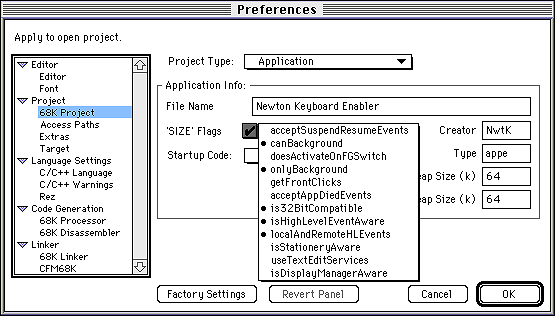

# Newton Keyboard Enabler 1.0

## Features

The Newton Keyboard Enabler (NKE) allows you to connect the Newton keyboard to any Macintosh and use it as a replacement for the big ADB keyboards. Very nice for presentations where space is rare.

The NKE is a system extension, but it does not do any trap patching. To be exact: the NKE is a FBA (faceless background application), that works like a normal application, but without any human interface. The NKE should work on any Macintosh with MacOS 7 and at least one free serial port. NKE will grab the serial port, so it is not possible for any other application to use the port.

You may quit the NKE with a “Quit” AppleEvent or with the hotkey Control-Option-^. Hold the three keys for about 2 seconds down, if it doesn't work: retry. If you are lucky, you hear three beeps, then you have to press a key on the Newton keyboard. After that, the NKE has quit.

The Newton Keyboard Enabler is freeware. You may use it as you wish, but need written permission for any commercial distribution!


## Configuring the NKE

The configuration is a bit tricky, you have to use ResEdit or Resorcerer!

1. Choose the serial port
Open NKE with ResEdit and open the STR# 128 Resource. For the modem port (the default) enter ".AIn" and ".AOut"; for the printer port enter ".BIn" and ".BOut". Pay attention to internal modems on PowerBooks etc.

2. Choose the keyboard layout and language
Open the PREF 128 resource (attention: only a Resorcerer template is available, ResEdit users have to use the hex-editor). The resource is 4 bytes long:
• The last byte is the keyboard language. 3 is default (Germany), you may want to change it to 0 (US-English).
• The first byte (default: 0 = off) allows you to send different codes for the shift keys of the Newton keyboard (set the value to 1). You should leave this value unchanged.

After installing NKE (dragging it onto the system folder) and connecting the keyboard to the right serial port, restart your Macintosh. If NKE can't recognize the keyboard, you may have to check the serial port. If the keyboard layout is wrong, you have to change the keyboard language.

Hint: You may change the Filetype of NKE from “appe” to “APPL” and launch NKE directly from your desktop - no restart necessary!


# German MacOpen article

Dieses mal will ich etwas zu dem Anschluß eines Newton Keyboards am Mac schreiben. Das Newton Keyboard ist nämlich durch seine kleinen Abmessungen ideal für Messen etc. zu verwenden.


## Der Anschluß

Das Newton Keyboard ist für etwas über 100,- DM im Apple Fachhandel zu erhalten. Das kleine schwarze Keyboard wird inklusiver einer Tasche geliefert. Da es beim Newton an die serielle Schnittstelle angeschlossen wird, kam mir die Idee das Keyboard an einen Mac anzuschließen. Mit Hilfe eines Terminalprogramms habe ich schnell ermitteln können, daß das Keyboard mit 9600 Baud seine Daten an den Rechner sendet - 8 Bits pro Zeichen, keine Parität, ein Stop-Bit. Elektrisch war die Ansteuerung also kein Problem.

Nun mußte ich rausbekommen, was für Daten von der Tastatur gesendet werden. Auch hier: keine Überraschungen. Die Tastatur sendet bei jedem Tastendruck bzw. beim Loslassen einer Taste ein Byte. Unterscheiden kann man das Drücken bzw. Loslassen einer Taste daran, daß beim Loslassen Bit 7 gesetzt wird. Der 7 Bit Scancode entspricht quasi zu 100% denen der normalen Mac-Keyboards.

Sobald die Schnittstelle geöffnet wird, sendet das Keyboard einen String mit Identifikationsdaten. Leider habe ich keine genaueren Informationen über den Aufbau der Daten, es reicht jedoch zur Erkennung der Newton-Tastatur.


## Die Software

Die Aufgabe eines Newton Keyboard Treibers ist also recht klar umrissen: Serielle Schnittstelle öffnen, die ersten Bytes ignorieren, dann bei jedem gesendeten Byte entweder das Drücken oder das Loslassen einer Taste melden. So weit so gut. Nur wie macht man das?

Ich wollte versuchen keine Systemerweiterung zu schreiben, die irgendwelche Traps patched, sondern dachte zuerst: das muß ja einfach sein, einfach per PostEvent() das Drücken und Loslassen melden und fertig. Leider ist es "etwas" komplizierter...

Der einfache Teil ist klar: ich schreibe eine "faceless background application" kurz FBA. Ein FBA verhält sich für den normalen Anwender, wie eine Systemerweiterung und wird auch in dem Ordner installiert. Für das MacOS handelt es sich aber um ein ganz normales Mac-Programm mit Event-Loop. FBAs dürfen jedoch - mit Ausnahme des Notification Managers - keine Bildschirmausgaben tätigen. Für einen Tastaturtreiber stellt dies aber kein Problem dar. FBAs erlauben AppleEvents und so kann man sehr elegant kleinere Erweiterungen für viele Programme als FBA implementieren z.B. AppleScript-Erweiterungen für FileMaker Pro.


## Die serielle Schnittstelle

Das Öffnen der Schnittstelle mit OpenDriver() ist relativ einfach und klar. Die Namen der Ports habe ich in den Resource-Fork abgelegt, so daß man sie bei Bedarf leicht ändern kann. Besser wäre natürlich ein Kontrollfeld, wo man den Port direkt wählen kann - oder die Möglichkeit den Port automatisch zu ermitteln. Die Baudrate setze ich danach auf 9600 8N1 - ist normalerweise eh Standard, aber sicher ist sicher. Handshaking ist für die Tastatur nicht nötig. Um der Tastatur die Möglichkeit zu geben ihre Identifikation zu senden, wartet der Treiber 1/2 Sekunde und liest dann alle an der seriellen Schnittstelle anliegenden Bytes ein. Welche Bytes erwartet werden, kann man dem Listing entnehmen. Ein kleiner Plausibilitätstest stellt sicher, daß auch wirklich eine Newton Tastatur angeschlossen ist.

Nun kommt aber der Trick: anstatt im Event-Loop die serielle Schnittstelle zu pollen, lese ich asynchron von der Schnittstelle! Dies belastet das MacOS fast gar nicht und bei jedem Byte, das an der Schnittstelle ankommt, wird automatisch eine Callback-Routine von mir aufgerufen. Dort verarbeite ich das gelesene Byte und starte den nächsten Lesevorgang. Einzige Falle ist hier, daß man den Parameterblock und andere Variablen globale halten muß, denn auf dem lokalen Stack würden sie ja beim Verlassen des Unterprogramms gleich gelöscht werden. Abstürze wären die Folge.

In der Testphase hat es sich als nützlich erwiesen, wenn man den Treiber beenden kann. Dazu setzt man den Dateityp nicht auf 'appe' (der Filetype von FBAs), sondern ganz normal auf 'APPL'. Nun kann man den Treiber einfach per Doppelklick starten. Per Hot-Key (Control-Option-^) bzw. Quit-AppleEvent verläßt der Treiber nun den Event-Loop. Nach drei SysBeeps() wartet er auf ein letztes Byte an der serielle Schnittstelle und beendet sich dann selbst. Den Hot-Key muß man etwas länger drücken, denn der Event-Loop wird nur einmal pro Sekunde durchlaufen. Normalerweise braucht der Treiber ja diesen Event-Loop gar nicht und so kostet er wenigstens kaum Rechenzeit.


## Die Scancodes

Die Tastatur meldet ja nur ein Byte für einen Tastendruck. Dieses Byte (Scancode genannt) muß nun in einen ASCII-Code umgerechnet werden. Dazu gibt es im MacOS die KMAP- und KCHR-Resourcen. KMAP erlaubt es Scancodes von verschiedenen Tastaturen zu normalisieren, d.h. auf gleiche Scancodes umzurechnen. Jede Tastatur kann ja völlig eigene Scancodes senden. Ferner wird in der KMAP-Resource definiert, bei welchen Tastendrücken die LEDs am erweiterten Keyboard angeschaltet werden. Das Newton Keyboard hat keine LEDs, so erübrigt sich weiterer Aufwand in diese Richtung.

Ebenfalls muß das Verhalten der Capslock-Taste simuliert werden. Beim Newton Keyboard wird sie ja nicht mechanisch blockiert. Man muß also per Software einen Caps-Schalter implementieren.

Den erzeugten normalisierten Keycode muß man nun in die KeyMap-Bitmaske übertragen. Diese Bitmaske erhält man, wenn man die Funktion GetKeys() aufruft. Viele Programme tun dies und wir müssen diese Bitmaske selbst aktualisieren. Hierbei gibt es folgendes zu beachten: es können mehrere Tastaturen angeschlossen sein! Jede Tastatur braucht ihre eigene interne KeyMap, die bei jedem Tastendruck einfach in die KeyMap des Systems kopiert wird.

Ferner müssen noch einige (undokumentierte) globale Variablen richtig gesetzt werden, damit u.a. Auto-Repeat funktioniert. Diese Variablen habe ich durch Analyse des originalen ADB-Treibers von Apple gefunden. Nunja, eine andere Möglichkeit kenne ich nicht und Auto-Repeat ist irgendwie zu witzig, als das man es nicht unterstützt.

Zu guter Letzt wird der Scancode in einen (oder zwei) ASCII-Codes umgerechnet. Dazu braucht man lediglich die Funktion KeyTranslate() aufrufen. Diese Funktion bekommt eine KCHR-Routine übergeben, welche beschreibt, wie man einen Scancode in einen ASCII-Code umrechnet. Unterschiedliche KCHR-Resourcen erlauben es z.B. für verschiedene Sprachen verschiedene Tastaturlayouts zu unterstützen. Die Scancodes sind nämlich - trotz unterschiedlich beschrifteter Tastenkappen - gleich! Es gibt aber noch ein paar Dinge zu beachten: Die Funktion kann zwei ASCII-Codes erzeugen, da einige Tastaturen auf einen realen Tastendruck zwei Tastendrücke simulieren. Ich glaube in Japan ist soetwas nicht unüblich. Ferner muß man den Status "state" global halten. In diesem Status wird zwischen zwei Tastendrücken gespeichert, ob z.B. ein Dead-Key gedrückt wurde. Beispiel: man drückt ein Taste, die ein Akzent einleitet und danach eine Taste, auf welche das Akzent gesetzt werden soll.

Zu guter Letzt wird der Tastendruck als keyDown bzw. keyUp Message an MacOS gepostet. Natürlich nicht ohne vorher noch ein paar undokumentierte Variablen im MacOS zu setzen. Nunja.


## Die Kompilierung



Um das Programm zu kompilieren muß lediglich der Source, wie auch die Resource kompiliert werden. Das Programm bekommt als Dateityp 'appe' und als Creatorcode 'NwtK' zugewiesen. 64k Speicherzuteilung reichen dicke. Lediglich die Flags müssen sorgfältig gesetzt werden (siehe Grafik). Wer will, kann den Dateityp auf 'APPL' setzen und den Treiber per Doppelklick bei Bedarf starten.

Um die serielle Schnittstelle zu ändern, muß man lediglich in der STR# 128 Resource die Einträge von ".AIn" und ".AOut" (Modemanschluß) z.B. auf ".BIn" und ".BOut" (Druckeranschluß) ändern.

In der PREF 128 Resource kann man sowohl das Keyboard Layout umschalten: das letzte Byte ist 3 für Deutschland oder 0 für US-Englisch. Weitere Layouts sind möglich, man muß lediglich entsprechende KCHR-Resourcen zur Verfügung stellen. Üblichweise sind seit MacOS 7.5 alle internationalen Keyboard-Layouts bereits im System vorhanden.

Das erste Byte ermöglicht es zwischen der KMAP 0 und KMAP 1 Resource zu wählen. Diese Layouts unterscheiden sich durch die Behandlung der gemeinsamen Shift-Tasten. Üblich ist es, daß beide Shift, Command, etc. Tasten den gleichen Scancode an die Anwenderprogramme melden. Wählt man die KMAP 1 Resource, so werden diese Tasten unterschiedlich gemeldet. Programme können dies zwar per Software umschalten (MagicMac nutzt dies z.B.), aber dies erfordert die direkte Programmierung der ADB-Tastaturen, was bei unserer Newton Tastatur an der seriellen Schnittstelle halt nicht möglich ist.

Die aktuelle Version des Newton Keyboard Enablers findet sich auf <https://github.com/sarnau> - neben vielen anderen Programmen von mir.


########################################
############### LISTINGs ###############
########################################
```c
/***
 *  Newton Keyboard Enabler.c
 *
 *  Erlaubt die Nutzung eines seriellen Newton-
 *  Keyboards an einem Mac. Das Keyboard verhält
 *  sich in fast allen Fällen genau wie ein
 *  originales ADB-Keyboard (Ausnahme: MacsBug
 *  kann es nicht nutzen)
 *
 *	Entwickelt mit dem CodeWarrior 9 von
 *	Metrowerks.
 *
 *  (c)1996 MAXON Computer, Markus Fritze
 ***/

// c_moeller@macopen.com

// true, wenn das Programm beendet werden soll
Boolean gDoQuitFlag;

/***
 *  unsere AppleEvent-Routinen
 *  (schließlich sind wir ein ordentliches
 *  MacOS Programm)
 ***/
static pascal OSErr DoAENoErr(
    const AppleEvent*, AppleEvent*, long)
{
  return noErr;   // AppleEvent ist ok
}

static pascal OSErr DoAEQuitAppl(
    const AppleEvent*, AppleEvent*, long)
{
  gDoQuitFlag = true; // Programm beenden
  return noErr;
}


// einen (hoffentlich) undefinierten Code
// benutzen wir als ID-Code für die Tastatur
#define NEWTON_KEYBOARD_CODE    117L


// Zugriffsfunktionen ähnlich <LowMem.h>
// für den Tastaturtreiber
static inline SInt16 LMGetKeyLast()
        { return *(SInt16*)0x0184; };
static inline void LMSetKeyLast(SInt16 value)
        { *(SInt16*)0x0184 = value; };
static inline SInt16 LMGetHiKeyLast()
        { return *(SInt16*)0x0216; };
static inline void LMSetHiKeyLast(SInt16 value)
        { *(SInt16*)0x0216 = value; };

static inline SInt32 LMGetKeyTime()
        { return *(SInt32*)0x0186; };
static inline void LMSetKeyTime(SInt32 value)
        { *(SInt32*)0x0186 = value; };
static inline SInt32 LMGetKeyRepTime()
        { return *(SInt32*)0x018A; };
static inline void LMSetKeyRepTime(SInt32 value)
        { *(SInt32*)0x018A = value; };

// ohne "inline", wegen eines 68k Compilerbugs
// beim CodeWarrior 9
static /*inline*/ KeyMap *LMGetKeyMapPtr()
        { return (KeyMap*)0x0174; };

// Unsere globalen Variablen für die Tastatur
Handle      gKMAP;
Handle      gKCHR;
UInt8     gKeyMap[16];

/***
 *  Keyboard-Variablen initialisieren
 ***/
static void InitKeyboard()
{
  Handle  thePref =
    ::Get1Resource('PREF', 128);

  // eigener Typ: Newton Keyboard
  gKMAP = ::Get1Resource('KMAP', **thePref);
  if(!gKMAP) ::ExitToShell();
  ::HLockHi(gKMAP);

  // ein deutsches Keyboard:
  gKCHR = ::GetResource('KCHR',
          ((short*)*thePref)[1]);
  if(!gKCHR)
    // ein US-Keyboard:
    gKCHR = ::GetResource('KCHR', 0);
  if(!gKCHR) ::ExitToShell();
  ::HLockHi(gKCHR);

  // eigene Keymap löschen
  for(int i=0; i<sizeof(gKeyMap); i++)
    gKeyMap[i] = 0;

  ::ReleaseResource(thePref);
}

/***
 *  Tastencode senden
 ***/
static void PostKeyMessage(
        UInt8 inKey, UInt8 inKeyCode)
{
  // keine Taste => raus
  if(inKey == 0x00L) return;

  // Message zusammensetzen
  UInt32  theMessage = inKey
        | UInt16(inKeyCode << 8)
        | (NEWTON_KEYBOARD_CODE << 16);

  // Taste gedrückt
  if(!(inKeyCode & 0x80)) {
    SInt32  theTicks = LMGetTicks();
    LMSetKeyTime(theTicks);
    LMSetKeyRepTime(theTicks);
    LMSetKeyLast(theMessage);
    LMSetHiKeyLast(NEWTON_KEYBOARD_CODE);
    ::PostEvent(keyDown, theMessage);

  // Taste losgelassen
  } else {
    // Key-Up-Flag löschen
    theMessage &= 0xFFFF7FFF;
    ::PostEvent(keyUp, theMessage);
  }
}

/***
 *  Tastendruck (bzw. das Loslassen) dem MacOS
 *  melden
 ***/
static void EnterKeycode(UInt8 inCode)
{
  // aktuelle Taste im System löschen
  LMSetKeyLast(0);
  LMSetHiKeyLast(0);

  // true, wenn Taste losgelassen wurde
  Boolean theDownFlag =
                (inCode & 0x80) == 0x80;

  // MacOS-Keycode erzeugen
  UInt8 theKeyCode;
  Ptr   theKMAP = *gKMAP;
  theKeyCode = theKMAP[(inCode & 0x7F) + 4];
  // Sondercode erkannt?
  if(theKeyCode & 0x80) {

    // erstmal das Kennungs-Bit löschen
    theKeyCode &= 0x7F;

    // Anzahl der Sondereinträge
    SInt16  theCount =
      *reinterpret_cast<SInt16*>
            (&theKMAP[0x84]);

    // ab hier geht es mit den Tabellen los
    UInt8 *theKMapP =
      reinterpret_cast<UInt8*>
            (&theKMAP[0x86]);
    while(theCount-- > 0) {
      // Code gefunden?
      if(*theKMapP++ != theKeyCode) {
        // zum nächsten Eintrag
        theKMapP += theKMapP[1] + 2;
        continue;
      }
      if((*theKMapP & 0x0F) == 0x00)
        return;
      break;
    }
  }

  // Capslock Abfrage
  if(theKeyCode == 0x39) {
    if(theDownFlag) { // Taste gedrückt?

      // Caps bereits gesetzt?
      if(gKeyMap[theKeyCode >> 3]
        & (1 << (theKeyCode & 7))) {
        // dann lösen!
        theDownFlag = false;
      }
    } else {  // Taste losgelassen?
      // (das interessiert uns nie!)
      return;
    }
  }

  // in die KeyMap eintragen (vorerst nur in
  // die eigene)
  if(theDownFlag) {
    gKeyMap[theKeyCode >> 3] |=
        1 << (theKeyCode & 7);
  } else {
    gKeyMap[theKeyCode >> 3] &=
        ~(1 << (theKeyCode & 7));

    // Flag für "losgelassen"
    theKeyCode |= 0x80;
  }

  // Tastencodes in globalen Variablen merken
  LMSetKbdLast(theKeyCode);
  LMSetKbdType(NEWTON_KEYBOARD_CODE);

  // globale KeyMap updaten
  ::BlockMoveData(gKeyMap, LMGetKeyMapPtr(),
          sizeof(KeyMap));

  // aktuelle Modifiers für KeyTranslate lesen
  UInt16  theModifiers = *(3 +
          reinterpret_cast<UInt16*>
          (LMGetKeyMapPtr()));

  // ROL.W #1,<ea>
  theModifiers = (theModifiers >> 15)
        | (theModifiers << 1);

  // ASCII-Codes (denkbar: zwei pro
  // Tastendruck!) errechnen
  static UInt32 state = 0;
  UInt32  lStructure = ::KeyTranslate(*gKCHR,
        theKeyCode | (theModifiers << 8),
                    &state);

  // ggf. zwei Tasten posten
  PostKeyMessage(lStructure >> 16, theKeyCode);
  PostKeyMessage(lStructure, theKeyCode);
}

/***
 *  diese asynchrone Routine pollt das Keyboard
 *  an der Seriellen
 ***/
#include <Serial.h>

// UPP für die Callback-Routine
IOCompletionUPP gIOUPP;

// Refnums für Serial ein/aus
SInt16      gSDIn, gSDOut;

// das empfangene Zeichen
UInt8     gInChar;

// der Parameterblock (asynchron!)
ParamBlockRec gParamBlk;

/***
 *	das nächste Byte von der
 *	Tastatur asynchron lesen
 ***/
static void   GetNextByte()
{
  if(gDoQuitFlag) return;
  // Callback setzen
  gParamBlk.ioParam.ioCompletion = gIOUPP;
  // Port lesen
  gParamBlk.ioParam.ioRefNum = gSDIn;
  // Buffer auf unser Byte
  gParamBlk.ioParam.ioBuffer = (Ptr)&gInChar;
	// ein Byte lesen
  gParamBlk.ioParam.ioReqCount = 1L;
  // ab der aktuellen Position
  gParamBlk.ioParam.ioPosMode = fsAtMark;
  // kein Offset...
  gParamBlk.ioParam.ioPosOffset = 0L;
  // Anforderung absetzen
  PBReadAsync(&gParamBlk);
}

/***
 *	Diese Routine wird angesprungen,
 *	wenn ein Byte eingetroffen ist.
 ***/
static void   MyCompletion(
          ParmBlkPtr ioParam : __A0)
{
#pragma unused(ioParam)

  // Byte verarbeiten
  EnterKeycode(gInChar);

  // nächstes Byte anfordern
  GetNextByte();
}

/***
 *  main()
 ***/
void    main()
{
  // 16k anstatt 2k an Stack!
  ::SetApplLimit((Ptr)((UInt32)
          ::GetApplLimit() - 0x4000));

  // Crasht vor MacOS 7.5.4, falls eine zweite
  // FBA ebenfalls MaxApplZone() aufruft:
  // ::MaxApplZone();

  // weitere Init-Calls sind bei FBAs nicht
  // erlaubt
  ::InitGraf(&qd.thePort);

  // AppleEvents installieren (wenn vorhanden)
  long  response;
  if(!::Gestalt(gestaltAppleEventsAttr,
          &response)) {
    if(response &
      (1L<<gestaltAppleEventsPresent)) {

      if(::AEInstallEventHandler(
            kCoreEventClass,
            kAEOpenApplication,
            NewAEEventHandlerProc(DoAENoErr),
            0L, 0))
        return;

      if(::AEInstallEventHandler(
            kCoreEventClass,
            kAEOpenDocuments,
            NewAEEventHandlerProc(DoAENoErr),
            0L, 0))
        return;

      if(::AEInstallEventHandler(
            kCoreEventClass,
            kAEPrintDocuments,
            NewAEEventHandlerProc(DoAENoErr),
            0L, 0))
        return;

      if(::AEInstallEventHandler(
            kCoreEventClass,
            kAEQuitApplication,
            NewAEEventHandlerProc(DoAEQuitAppl),
            0L, 0))
        return;
    }
  }

  // globale Keyboard-Variablen initialisieren
  InitKeyboard();

  // ".AIn" und ".AOut" öffnen
  OSErr theErr;
  Str255  theStr;
  ::GetIndString(theStr, 128, 2);
  theErr = ::OpenDriver(theStr, &gSDOut);
  if(theErr) ::ExitToShell();
  ::GetIndString(theStr, 128, 1);
  theErr = ::OpenDriver(theStr, &gSDIn);
  if(theErr) goto raus;

  // 9600 8N1
  theErr = ::SerReset(gSDOut,
                baud9600+data8+stop10+noParity);
  if(theErr) goto raus;

  // Handshaking ausschalten
  SerShk  theSHandShk;
  theSHandShk.fXOn = 0;
  theSHandShk.fCTS = 0;
  theSHandShk.errs = 0;
  theSHandShk.evts = 0;
  theSHandShk.fInX = 0;
  theSHandShk.fDTR = 0;
  theErr = ::Control(gSDOut, 14, &theSHandShk);
  if(theErr) goto raus;

  long  theTicks;
  // 1/2 Sekunde auf das Keyboard warten
  ::Delay(30, &theTicks);

  // Anzahl der Byte an der Schnittstelle ermitteln
  SInt32  theCount;
  ::SerGetBuf(gSDIn, &theCount);

  // und alle lesen
  Str255  theBuf;
  ::FSRead(gSDIn, &theCount, &theBuf);

  // Daten von der Tastatur zum Rechner, wenn die
  // Schnittstelle angeschaltet wird (9600 8N1):
  //  <0x16><0x10> 0x02,
  //  'd_id', 0x0CL,        // Device-ID?
  //  'kybd','appl', 0x01L,   // Keyboard-Typ
  //  'nofm', 0L, 0x1003dde7L   // ???
  if(reinterpret_cast<long*>(&theBuf)[3]
        != 'ybda')
    goto raus;

  gIOUPP = NewIOCompletionProc(MyCompletion);
  GetNextByte();  // erstes Byte erwarten

  gDoQuitFlag = false;
  while(!gDoQuitFlag) {
    EventRecord theEvent;
    // nur einmal pro Sekunde erwarten wir einen
    // Null-Event!
    ::WaitNextEvent(
            everyEvent, &theEvent, 60, 0L);
    if(theEvent.what == kHighLevelEvent)
      ::AEProcessAppleEvent(&theEvent);

#if DEBUG
    // zum Debuggen: '^' + Control + Option
    // beendet das Programm!
    KeyMap  theMap;
    ::GetKeys(theMap);
    if((theMap[0] & 0x40000) &&
        ((theMap[1] & 0xC) == 0xC)) {
      break;
    }
#endif
  }
  // auf ein letztes Byte warten!
  SysBeep(10); SysBeep(10); SysBeep(10);

  // auf Abschluß des aktuellen Polls warten
  while(gParamBlk.ioParam.ioResult > 0) {}

  // Tastaturstatus zurücksetzen
  LMSetKeyLast(0);
  LMSetHiKeyLast(0);
  for(int i=0; i<sizeof(gKeyMap); i++)
    gKeyMap[i] = 0;
  ::BlockMoveData(gKeyMap, LMGetKeyMapPtr(),
                  sizeof(KeyMap));

raus:
  if(gSDOut) ::KillIO(gSDOut);
  if(gSDIn) ::CloseDriver(gSDIn);
  if(gSDOut) ::CloseDriver(gSDOut);
}


/***
 *	Newton Keyboard.r
 ***/
resource 'KMAP' (0) {
	0,
	0,
	{	0,1,2,3,4,5,6,7,8,9,10,11,12,13,14,15,16,17,
		18,19,20,21,22,23,24,25,26,27,28,29,30,31,32,
		33,34,35,36,37,38,39,40,41,42,43,44,45,46,47,
		48,49,50,51,52,53,59,55,56,57,58,59,56,58,59,
		63,64,65,66,67,68,69,70,71,72,73,74,75,76,77,
		78,79,80,81,82,83,84,85,86,87,88,89,90,91,92,
		93,94,95,96,97,98,99,100,101,102,103,104,105,
		106,107,108,109,110,111,112,113,114,115,116,
		117,118,119,120,121,122,123,124,125,126,127
	},
	{
	}
};

resource 'KMAP' (1) {
	0,
	0,
	{	0,1,2,3,4,5,6,7,8,9,10,11,12,13,14,15,16,17,
		18,19,20,21,22,23,24,25,26,27,28,29,30,31,32,
		33,34,35,36,37,38,39,40,41,42,43,44,45,46,47,
		48,49,50,51,52,53,59,55,56,57,58,59,60,61,62,
		63,64,65,66,67,68,69,70,71,72,73,74,75,76,77,
		78,79,80,81,82,83,84,85,86,87,88,89,90,91,92,
		93,94,95,96,97,98,99,100,101,102,103,104,105,
		106,107,108,109,110,111,112,113,114,115,116,
		117,118,119,120,121,122,123,124,125,126,127
	},
	{
	}
};

resource 'STR#' (128, "Portnames") {
	{	".AIn",
		".AOut"
	}
};

data 'TMPL' (128, "PREF") {
	/* .Different Shift */
	$"1544 6966 6665 7265 6E74 2053 6869 6674"
	/* -Keys?BOOL.Keybo */
	$"2D4B 6579 733F 424F 4F4C 0E4B 6579 626F"
	/* ardregionRGNC */
	$"6172 6472 6567 696F 6E52 474E 43"
};

data 'PREF' (128) {
	$"0000 0003"
};

/***
 *	ab hier: optional!
 ***/
resource 'vers' (1) {
	0x1,
	0x0,
	release,
	0x0,
	verGermany,
	"1.0",
	"1.0, ©1996 MAXON Computer, Markus Fritze"
};

resource 'BNDL' (128) {
	'NwtK',
	0,
	{	'FREF', { 0, 128 },
		'ICN#', { 0, 128 }
	}
};

resource 'FREF' (128) {
	'appe',
	0,
	""
};

resource 'icl4' (128) {
	$"0FFF FFFF FFFF FFFF FFFF FFFF FFFF 0000"
	$"F000 0000 0000 0000 0000 0000 000C F000"
	$"F0CC CCCC CCCC CCCC CCCC CCCC CCCC F000"
	$"F0CC CCCC CCCC CCCC CCCC CCCC CCCC F000"
	$"F0CC CCCC CCCC CCCC CCCC CCCC CCCC F000"
	$"F0CC CCCC CCCC CCCC CCCC CCCC CCCC F000"
	$"F0CC CCCC CCCC CCCC CCCC CCCC CCCC F000"
	$"F0CC CCCC CCCC CCCC CCCC CCCC CCCC F000"
	$"F0CC CCCC CCCC CCCC CCCC CCCC CCCC F000"
	$"FF0F CCCC CCCC CCCC CCCC CCCC CCCC F0F0"
	$"F0FF CCCC CCCC CCCC CCCC CCCC CCCC FF0F"
	$"000F CC99 9999 9999 9999 9999 99CC F0CF"
	$"000F CC99 9999 9999 9999 9999 99CC CCCF"
	$"000F CC99 C9C9 C9C9 C9C9 C9C9 99CC CCCF"
	$"000F CC99 9999 9999 9999 9999 99CC CCCF"
	$"000F CC99 9C9C 9C9C 9C9C 9C9C 99CC CCCF"
	$"000F CC99 9999 9999 9999 9999 99CC CCCF"
	$"000F CC99 C9C9 C9C9 C9C9 C9C9 99CC CCCF"
	$"000E CC99 9999 9999 9999 9999 99CC CCCF"
	$"000E CC99 9C9C 9CCC CCCC 9C9C 99CC CCCF"
	$"000F CC99 9999 9999 9999 9999 99CC FCCF"
	$"F00F CC99 9999 9999 9999 9999 99CC FFCF"
	$"FF0F CCCC CCCC CCCC CCCC CCCC CCCC F0F0"
	$"F0F0 CCCC CCCC CCCC CCCC CCCC CCCC F000"
	$"F0CC CCCC CCCC CCCC CCCC CCCC CCCC F000"
	$"F0CC CCCC CCCC CCCC CCCC CCCC CCCC F000"
	$"F0CC CCCC CCCC CCCC CCCC CCCC CCCC F000"
	$"F0CC CCCC CCCC CCCC CCCC CCCC CCCC F000"
	$"F0CC CCCC CCCC CCCC CCCC CCCC CCCC F000"
	$"F0CC CCCC CCCC CCCC CCCC CCCC CCCC F000"
	$"FCCC CCCC CCCC CCCC CCCC CCCC CCCC F000"
	$"0FFF FFFF FFFF FFFF FFFF FFFF FFFF"
};

resource 'icl8' (128, purgeable) {
	$"00FF FFFF FFFF FFFF FFFF FFFF FFFF FFFF"
	$"FFFF FFFF FFFF FFFF FFFF FFFF 0000 0000"
	$"FF00 0000 0000 0000 0000 0000 0000 0000"
	$"0000 0000 0000 0000 0000 00F6 FF00 0000"
	$"FF00 F6F6 F6F6 F6F6 F6F6 F6F6 F6F6 F6F6"
	$"F6F6 F6F6 F6F6 F6F6 F6F6 F6F8 FF00 0000"
	$"FF00 F6F6 F6F6 F6F6 F6F6 F6F6 F6F6 F6F6"
	$"F6F6 F6F6 F6F6 F6F6 F6F6 F6F8 FF00 0000"
	$"FF00 F6F6 F6F6 F6F6 F6F6 F6F6 F6F6 F6F6"
	$"F6F6 F6F6 F6F6 F6F6 F6F6 F6F8 FF00 0000"
	$"FF00 F6F6 F6F6 F6F6 F6F6 F6F6 F6F6 F6F6"
	$"F6F6 F6F6 F6F6 F6F6 F6F6 F6F8 FF00 0000"
	$"FF00 F6F6 F6F6 F6F6 F6F6 F6F6 F6F6 F6F6"
	$"F6F6 F6F6 F6F6 F6F6 F6F6 F6F8 FF00 0000"
	$"FF00 F6F6 F6F6 F6F6 F6F6 F6F6 F6F6 F6F6"
	$"F6F6 F6F6 F6F6 F6F6 F6F6 F6F8 FF00 0000"
	$"FF00 F6F6 F6F6 F6F6 F6F6 F6F6 F6F6 F6F6"
	$"F6F6 F6F6 F6F6 F6F6 F6F6 F6F8 FF00 0000"
	$"FFFF 00FF F8F6 F6F6 F6F6 F6F6 F6F6 F6F6"
	$"F6F6 F6F6 F6F6 F6F6 F6F6 F6F8 FF00 FF00"
	$"FF00 FFFF F8F6 F6F6 F6F6 F6F6 F6F6 F6F6"
	$"F6F6 F6F6 F6F6 F6F6 F6F6 F6F8 FFFF 00FF"
	$"0000 00FF F8F6 A5A5 A5A5 A5A5 A5A5 A5A5"
	$"A5A5 A5A5 A5A5 A5A5 A5A5 F6F8 FF00 F6FF"
	$"0000 00FF F8F6 A5A5 A5A5 A5A5 A5A5 A5A5"
	$"A5A5 A5A5 A5A5 A5A5 A5A5 F6F6 F6F6 F8FF"
	$"0000 00FF F8F6 A5A5 F8A5 F8A5 F8A5 F8A5"
	$"F8A5 F8A5 F8A5 F8A5 A5A5 F6F6 F6F6 F8FF"
	$"0000 00FF F8F6 A5A5 A5A5 A5A5 A5A5 A5A5"
	$"A5A5 A5A5 A5A5 A5A5 A5A5 F6F6 F6F6 F8FF"
	$"0000 00FF F8F6 A5A5 A5F8 A5F8 A5F8 A5F8"
	$"A5F8 A5F8 A5F8 A5F8 A5A5 F6F6 F6F6 F8FF"
	$"0000 00FF F8F6 A5A5 A5A5 A5A5 A5A5 A5A5"
	$"A5A5 A5A5 A5A5 A5A5 A5A5 F6F6 F6F6 F8FF"
	$"0000 00FF F8F6 A5A5 F8A5 F8A5 F8A5 F8A5"
	$"F8A5 F8A5 F8A5 F8A5 A5A5 F6F6 F6F6 F8FF"
	$"0000 00FC F8F6 A5A5 A5A5 A5A5 A5A5 A5A5"
	$"A5A5 A5A5 A5A5 A5A5 A5A5 F6F6 F6F6 F8FF"
	$"0000 00FC F8F6 A5A5 A5F8 A5F8 A5F8 F8F8"
	$"F8F8 F8F8 A5F8 A5F8 A5A5 F6F6 F6F6 F8FF"
	$"0000 00FF F8F6 A5A5 A5A5 A5A5 A5A5 A5A5"
	$"A5A5 A5A5 A5A5 A5A5 A5A5 F6F8 FFF8 F8FF"
	$"FF00 00FF F8F6 A5A5 A5A5 A5A5 A5A5 A5A5"
	$"A5A5 A5A5 A5A5 A5A5 A5A5 F6F8 FFFF F8FF"
	$"FFFF 00FF F8F6 F6F6 F6F6 F6F6 F6F6 F6F6"
	$"F6F6 F6F6 F6F6 F6F6 F6F6 F6F8 FF00 FF00"
	$"FF00 FF00 F6F6 F6F6 F6F6 F6F6 F6F6 F6F6"
	$"F6F6 F6F6 F6F6 F6F6 F6F6 F6F8 FF00 0000"
	$"FF00 F6F6 F6F6 F6F6 F6F6 F6F6 F6F6 F6F6"
	$"F6F6 F6F6 F6F6 F6F6 F6F6 F6F8 FF00 0000"
	$"FF00 F6F6 F6F6 F6F6 F6F6 F6F6 F6F6 F6F6"
	$"F6F6 F6F6 F6F6 F6F6 F6F6 F6F8 FF00 0000"
	$"FF00 F6F6 F6F6 F6F6 F6F6 F6F6 F6F6 F6F6"
	$"F6F6 F6F6 F6F6 F6F6 F6F6 F6F8 FF00 0000"
	$"FF00 F6F6 F6F6 F6F6 F6F6 F6F6 F6F6 F6F6"
	$"F6F6 F6F6 F6F6 F6F6 F6F6 F6F8 FF00 0000"
	$"FF00 F6F6 F6F6 F6F6 F6F6 F6F6 F6F6 F6F6"
	$"F6F6 F6F6 F6F6 F6F6 F6F6 F6F8 FF00 0000"
	$"FF00 F6F6 F6F6 F6F6 F6F6 F6F6 F6F6 F6F6"
	$"F6F6 F6F6 F6F6 F6F6 F6F6 F6F8 FF00 0000"
	$"FFF6 F8F8 F8F8 F8F8 F8F8 F8F8 F8F8 F8F8"
	$"F8F8 F8F8 F8F8 F8F8 F8F8 F8F8 FF00 0000"
	$"00FF FFFF FFFF FFFF FFFF FFFF FFFF FFFF"
	$"FFFF FFFF FFFF FFFF FFFF FFFF"
};

resource 'ICN#' (128) {
	{	$"7FFF FFF0 8000 0008 8000 0008 8000 0008"
		$"8000 0008 8000 0008 8000 0008 8000 0008"
		$"8000 0008 D000 000A B000 000D 13FF FFC9"
		$"13FF FFC1 1355 55C1 13FF FFC1 13AA AAC1"
		$"13FF FFC1 1355 55C1 13FF FFC1 13A8 0AC1"
		$"13FF FFC9 93FF FFCD D000 000A A000 0008"
		$"8000 0008 8000 0008 8000 0008 8000 0008"
		$"8000 0008 8000 0008 8000 0008 7FFF FFF0",

		$"7FFF FFF0 FFFF FFF8 FFFF FFF8 FFFF FFF8"
		$"FFFF FFF8 FFFF FFF8 FFFF FFF8 FFFF FFF8"
		$"FFFF FFF8 DFFF FFFA 9FFF FFFF 1FFF FFFF"
		$"1FFF FFFF 1FFF FFFF 1FFF FFFF 1FFF FFFF"
		$"1FFF FFFF 1FFF FFFF 1FFF FFFF 1FFF FFFF"
		$"1FFF FFFF 9FFF FFFF DFFF FFFA FFFF FFF8"
		$"FFFF FFF8 FFFF FFF8 FFFF FFF8 FFFF FFF8"
		$"FFFF FFF8 FFFF FFF8 FFFF FFF8 7FFF FFF0"
	}
};

resource 'ics#' (128) {
	{	$"FFFE 8002 8002 8002 C003 DFFB 5559 5FF9"
		$"5A29 5FF9 DFFB C003 8002 8002 8002 FFFE",

		$"FFFE FFFE FFFE FFFE FFFE FFFF 7FFF 7FFF"
		$"7FFF 7FFF FFFF FFFE FFFE FFFE FFFE FFFE"
	}
};

resource 'ics4' (128) {
	$"FFFF FFFF FFFF FFF0 FCCC CCCC CCCC CCF0"
	$"FCCC CCCC CCCC CCF0 FCCC CCCC CCCC CCF0"
	$"FFCC CCCC CCCC CCFF FFC9 9999 9999 9CFF"
	$"0FC9 D9D9 D9D9 9CCF 0FC9 9999 9999 9CCF"
	$"0FC9 9D9D DD9D 9CCF 0EC9 9999 9999 9CCF"
	$"FFC9 9999 9999 9CFF FFCC CCCC CCCC CCFF"
	$"FCCC CCCC CCCC CCF0 FCCC CCCC CCCC CCF0"
	$"FCCC CCCC CCCC CCF0 FFFF FFFF FFFF FFF0"
};

resource 'ics8' (128) {
	$"FFFF FFFF FFFF FFFF FFFF FFFF FFFF FF00"
	$"FFF6 F6F6 F6F6 F6F6 F6F6 F6F6 F6F8 FF00"
	$"FFF6 F6F6 F6F6 F6F6 F6F6 F6F6 F6F8 FF00"
	$"FFF6 F6F6 F6F6 F6F6 F6F6 F6F6 F6F8 FF00"
	$"FFFF F8F6 F6F6 F6F6 F6F6 F6F6 F6F8 FFFF"
	$"FFFF F8A5 A5A5 A5A5 A5A5 A5A5 A5F8 FFFF"
	$"00FF F8A5 F8A5 F8A5 F8A5 F8A5 A5F6 F6FF"
	$"00FF F8A5 A5A5 A5A5 A5A5 A5A5 A5F6 F6FF"
	$"00FF F8A5 A5F8 A5F8 F8F8 A5F8 A5F6 F6FF"
	$"00FC F8A5 A5A5 A5A5 A5A5 A5A5 A5F6 F6FF"
	$"FFFF F8A5 A5A5 A5A5 A5A5 A5A5 A5F8 FFFF"
	$"FFFF F8F6 F6F6 F6F6 F6F6 F6F6 F6F8 FFFF"
	$"FFF6 F6F6 F6F6 F6F6 F6F6 F6F6 F6F8 FF00"
	$"FFF6 F6F6 F6F6 F6F6 F6F6 F6F6 F6F8 FF00"
	$"FFF6 F6F6 F6F6 F6F6 F6F6 F6F6 F6F8 FF00"
	$"FFFF FFFF FFFF FFFF FFFF FFFF FFFF FF"
};

data 'NwtK' (0, "Owner resource") {
	$"00"
};
```
